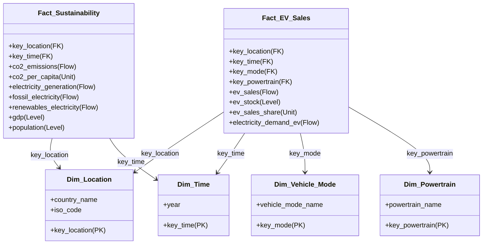

# PRESENTAZIONE E PROFILAZIONE DEI DATASET
## Progetto di Data Management

## 1. INTRODUZIONE E OBIETTIVI DEL DATA WAREHOUSE

Il presente documento descrive le attività di analisi e profilazione dei dati condotte come prima fase del progetto finale di **Data Warehousing** per il corso di "Data Management". Il focus primario dello studio riguarda la relazione tra la **transizione verso la mobilità elettrica (electric mobility)** e la **sostenibilità energetico-ambientale**. 

L'obiettivo fondamentale consiste nell'integrare dati provenienti da fonti eterogenee per verificare se la crescente diffusione di veicoli elettrici stia effettivamente riducendo le emissioni globali di gas serra o se, al contrario, stia semplicemente trasferendo l'impatto ambientale dai motori a combustione interna alla generazione elettrica, qualora quest'ultima si basi ancora su fonti fossili. L'analisi integra inoltre una prospettiva finanziaria e di sviluppo macroeconomico, valutando come la capacità di investimento dei diversi paesi (misurata tramite il GDP) influenzi l'efficacia di questa transizione ecologica.

Per questo studio vengono integrati tre dataset chiave:
1. **IEA Global EV Sales (2010–2024)**: per monitorare le vendite storiche, lo stock di veicoli elettrici sul mercato ed i punti di ricarica.
2. **Our World in Data (OWID) CO2 and Greenhouse Gas Emissions**: per tracciare le emissioni di anidride carbonica e carbone a livello nazionale.
3. **Our World in Data (OWID) Energy Dataset**: per monitorare la produzione e il consumo di energia e lo split delle fonti nel mix di generazione elettrica.

In conformità con le specifiche di progetto, è stato **deliberatamente escluso il Dataset 4 (World Bank Development Indicators)**. Questa decisione è giustificata dal fatto che i parametri macroeconomici e demografici fondamentali (come la popolazione ed il PIL - GDP) sono già registrati con elevata affidabilità e dettaglio temporale sia nel dataset CO2 che nel dataset Energy di Our World in Data. L'inclusione del Dataset 4 avrebbe introdotto ridondanze esterne, complicando inutilmente la fase di join dei dati senza apportare alcun valore informativo aggiuntivo.

---

## 2. ANALISI E PROFILAZIONE DEI DATASET

---

### DATASET 1: IEA Global EV Sales (2010-2024)

#### A. Presentazione e Contesto Generale
Questo dataset raccoglie i dati ufficiali pubblicati dalla **International Energy Agency (IEA)** nel suo annuale *Global EV Outlook* ed è ospitato pubblicamente su Kaggle a cura di Patrick L. Ford. Raccoglie i dati storici e le proiezioni (fino al 2035) sulle vendite, sullo stock e sulle infrastrutture di ricarica di veicoli elettrici a livello globale.
Le informazioni comprendono le tipologie di veicoli elettrici (BEV - Battery Electric Vehicles, PHEV - Plug-in Hybrid Electric Vehicles e FCEV - Fuel Cell Electric Vehicles) suddivisi per categoria di trasporto (Cars, Vans, Buses, Trucks). È fondamentale nel progetto per rappresentare l'adozione ed il consumo teorico di energia dei veicoli elettrici.

#### B. Profilazione Tecnica dei Dati
- **Dimensione del dataset**: Il file CSV grezzo ha una dimensione di **12.654 righe** e **8 colonne**.
- **Granularità**: Nella sua struttura originaria in formato *long*, la **Granularity** è definita dalla tupla: `[Region/Country, Year, Vehicle Mode, Powertrain, Parameter]`. Per ogni riga viene registrata una singola misura (es. vendite, stock, quota di mercato) per una data combinazione geografica, temporale, tecnologica e merceologica.

#### C. Dizionario dei Dati e Analisi degli Attributi
Il dataset originale è strutturato con le seguenti colonne:

### Tabella Profilazione: iea-global-ev-sales
| Nome Colonna | Data Type | Descrizione | Range / Valori Ammissibili | Presenza di Null Values |
| :--- | :--- | :--- | :--- | :--- |
| `region` | VARCHAR | Nome geografico del Paese, regione o aggregato economico (es. EU27, World, USA). | 54 valori unici. Esempi: 'Australia', 'Austria', 'Belgium' | 0 (Popolato al 100%) |
| `category` | VARCHAR | Categoria del dato: Historical (storico) o Projection (proiezioni fino al 2035). | 3 categorie: 'Historical', 'Projection-STEPS', 'Projection-APS' | 0 (Popolato al 100%) |
| `parameter` | VARCHAR | Tipo di metrica del veicolo elettrico (es. EV sales, EV stock, EV sales share, charging points). | 8 valori unici. Esempi: 'EV stock share', 'EV sales share', 'EV sales' | 0 (Popolato al 100%) |
| `mode` | VARCHAR | Tipo di veicolo (Cars, Vans, Buses, Trucks, EV). | 5 categorie: 'Cars', 'EV', 'Buses', 'Vans', 'Trucks' | 0 (Popolato al 100%) |
| `powertrain` | VARCHAR | Tipo di propulsione (BEV - Battery Electric, PHEV - Plug-in Hybrid, FCEV - Fuel Cell, EV). | 6 categorie: 'EV', 'BEV', 'PHEV', 'Publicly available fast', 'Publicly available slow', 'FCEV' | 0 (Popolato al 100%) |
| `year` | INT | Anno di riferimento del dato (2010 - 2024 / 2035). | Min: 2,010 Max: 2,035 | 0 (Popolato al 100%) |
| `unit` | VARCHAR | Unità di misura della metrica (percent, Vehicles, charging points, GWh, etc.). | 6 categorie: 'percent', 'Vehicles', 'charging points', 'GWh', 'Milion barrels per day', 'Oil displacement, million lge' | 0 (Popolato al 100%) |
| `value` | FLOAT | Valore numerico associato al parametro. | Min: 0.00 Max: 440,000,000.00 | 0 (Popolato al 100%) |

#### D. Valutazione in Ottica Data Warehousing
Basandoci sulle linee guida metodologiche del **Dimensional Fact Model (DFM)**:
- **Candidati come Misure (measures) in una Fact Table**:
  - `ev_sales` (**Flow Measure**): rappresenta il flusso cumulativo annuale di vendite. È pienamente additiva su tutte le dimensioni (tempo, spazio, veicolo, tecnologia).
  - `ev_stock` (**Level Measure**): rappresenta lo stato dello stock di veicoli su strada a fine anno. È non-additiva lungo la dimensione temporale (sommare lo stock del 2020 e del 2021 non ha senso logico, si usano operatori come `AVG` o `MAX`), ma è additiva lungo le gerarchie spaziali (es. somma dei paesi europei) e merceologiche (somma di auto e furgoni).
  - `electricity_demand` (**Flow Measure**): domanda elettrica stimata degli EV (GWh). Completamente additiva.
  - `ev_charging_points` (**Level Measure**): numero di colonnine. Non-additiva nel tempo, additiva nello spazio.
  - `oil_displacement` (**Flow Measure**): petrolio risparmiato in milioni di barili equivalenti. Completamente additiva.
  - `ev_sales_share` e `ev_stock_share` (**Unit Measures**): rappresentano delle quote percentuali. Sono non-additive lungo tutte le dimensioni e devono essere aggregate calcolando medie pesate sui volumi assoluti o tramite operatori non additivi (`AVG`, `MIN`, `MAX`).
- **Candidati come Attributi Descrittivi in una Dimension Table**:
  - `region` (rinominata `country` in ETL): attributo radice (root) della dimensione geografica (`Dim_Location`).
  - `year`: attributo radice della dimensione temporale (`Dim_Time`).
  - `mode`: attributo radice della dimensione del tipo di veicolo (`Dim_Vehicle_Mode`).
  - `powertrain`: attributo radice della dimensione della propulsione (`Dim_Powertrain`).
  - `category`: attributo descrittivo legato allo scenario temporale (dati storici vs proiezioni).
- **Data Quality Issues da gestire nella fase di ETL**:
  - **Aggregati Geografici**: Il campo `region` contiene sia nazioni singole sia raggruppamenti multinazionali (es. `World`, `EU27`, `Rest of the world`). Tali righe devono essere rimosse se si effettuano analisi aggregate dei paesi per evitare double-counting.
  - **Discrepanze Geografiche**: I nomi dei paesi non seguono lo standard ISO (es. `USA`, `Korea`, `Turkiye`, `Czech Republic`). Questi nomi devono essere mappati e standardizzati per allinearsi ai codici ISO dei dataset OWID.
  - **Formato Long**: La struttura a righe deve essere ruotata (operazione di Pivoting) sulla colonna `parameter` per spostare i singoli parametri in colonne separate e allineare la granularità.

---

### DATASET 2: Our World in Data (OWID) CO2 and Greenhouse Gas Emissions

#### A. Presentazione e Contesto Generale
Questo dataset è manutenuto da **Our World in Data (OWID)** ed è basato sui dati del *Global Carbon Project* (GCP) e su altre ricerche storiche (CDIAC, IEA). Traccia le emissioni storiche e correnti di anidride carbonica (CO2) e altri gas climalteranti, la popolazione ed indicatori economici nazionali (GDP). Consente di monitorare l'evoluzione dell'impatto climatico globale, essenziale per verificare se l'adozione delle auto elettriche stia mitigando le emissioni a livello nazionale ed internazionale.

#### B. Profilazione Tecnica dei Dati
- **Dimensione del dataset**: Il file CSV grezzo ha una dimensione di **50.411 righe** e **79 colonne**.
- **Granularità**: La **Granularity** del dataset è `[Country, Year]`. Ciascuna riga descrive i dati cumulativi o di stato per un paese in un dato anno.

#### C. Dizionario dei Dati e Analisi degli Attributi
Vengono di seguito documentate le sole colonne ritenute rilevanti ed estratte nella fase di ETL:

### Tabella Profilazione: owid-co2-data
| Nome Colonna | Data Type | Descrizione | Range / Valori Ammissibili | Presenza di Null Values |
| :--- | :--- | :--- | :--- | :--- |
| `country` | VARCHAR | Nome del Paese o regione geografica. | 254 valori unici. Esempi: 'Afghanistan', 'Africa', 'Africa (GCP)' | 0 (Popolato al 100%) |
| `year` | INT | Anno di riferimento del dato (2010 - 2024 / 2035). | Min: 1,750 Max: 2,024 | 0 (Popolato al 100%) |
| `iso_code` | VARCHAR | Codice ISO standard a 3 lettere del Paese (nullo per regioni aggregate). | 218 valori unici. Esempi: 'AFG', 'ALB', 'DZA' | 7,931 (15.73%) |
| `population` | FLOAT | Popolazione totale del Paese/regione per l'anno di riferimento. | Min: 215.00 Max: 8,161,972,574.00 | 9,244 (18.34%) |
| `gdp` | FLOAT | Prodotto Interno Lordo (GDP) corretto per la parità di potere d'acquisto (PPP) in dollari costanti 2011. | Min: 49,980,000.00 Max: 130,112,562,171,125.00 | 35,160 (69.75%) |
| `co2` | FLOAT | Emissioni totali di anidride carbonica (CO2) prodotte da combustione fossile e processi industriali (in milioni di tonnellate). | Min: 0.00 Max: 38,598.58 | 21,027 (41.71%) |
| `co2_per_capita` | FLOAT | Emissioni di CO2 per abitante (in tonnellate). | Min: 0.00 Max: 782.74 | 23,902 (47.41%) |
| `co2_per_gdp` | FLOAT | Emissioni di CO2 per unità di PIL (in chilogrammi per dollaro PPP). | Min: 0.00 Max: 82.60 | 32,883 (65.23%) |
| `oil_co2` | FLOAT | Emissioni di CO2 da petrolio (in milioni di tonnellate). | Min: 0.00 Max: 12,470.60 | 24,952 (49.50%) |
| `oil_co2_per_capita` | FLOAT | Emissioni di CO2 da petrolio per abitante (in tonnellate). | Min: 0.00 Max: 782.74 | 25,689 (50.96%) |
| `coal_co2` | FLOAT | Emissioni di CO2 da carbone (in milioni di tonnellate). | Min: 0.00 Max: 15,805.25 | 28,486 (56.51%) |
| `coal_co2_per_capita` | FLOAT | Emissioni di CO2 da carbone per abitante (in tonnellate). | Min: 0.00 Max: 34.30 | 29,097 (57.72%) |
| `co2_per_unit_energy` | FLOAT | Emissioni di CO2 prodotte per unità di energia consumata (in kg per kilowattora). | Min: 0.00 Max: 10,688.90 | 39,585 (78.52%) |
| `primary_energy_consumption` | FLOAT | Consumo totale di energia primaria (in terawattora, TWh). | Min: 0.00 Max: 176,737.09 | 39,780 (78.91%) |

#### D. Valutazione in Ottica Data Warehousing
- **Candidati come Misure (measures) in una Fact Table**:
  - `co2`, `oil_co2`, `coal_co2` (**Flow Measures**): rappresentano i flussi annuali cumulati di emissioni. Additive lungo tempo e spazio.
  - `primary_energy_consumption` (**Flow Measure**): consumo energetico annuale. Completamente additiva.
  - `population` e `gdp` (**Level Measures**): misurano lo stato demografico ed economico all'anno T. Non-additive lungo il tempo, ma additive lungo le altre dimensioni non temporali.
  - `co2_per_capita`, `co2_per_gdp`, `oil_co2_per_capita`, `coal_co2_per_capita`, `co2_per_unit_energy` (**Unit Measures**): derivanti da rapporti. Totalmente non-additive. Si raccomanda di memorizzare separatamente i numeratori ed i denominatori e calcolare il rapporto a livello di query OLAP, oppure limitarsi all'uso di `AVG`, `MIN`, `MAX`.
- **Candidati come Attributi Descrittivi in una Dimension Table**:
  - `country`: attributo radice per la dimensione geografica (`Dim_Location`).
  - `iso_code`: codice ISO a tre lettere, attributo descrittivo del paese in relazione 1-to-1 con `country`.
  - `year`: attributo radice per la dimensione temporale (`Dim_Time`).
- **Data Quality Issues da gestire nella fase di ETL**:
  - **Valori Nulli Storici**: Il dataset parte dal 1750, introducendo una percentuale massiccia di Null Values (es. il GDP è nullo al 69.75% delle righe globali). Per l'orizzonte temporale del progetto (2010–2024), i dati sono quasi interamente coperti, ma rimangono valori nulli per nazioni insulari o piccoli stati che vanno filtrati.
  - **Aggregati Geografici Privi di ISO**: Le righe relative a macro-regioni (es. `Africa (GCP)`, `Europe`) non possiedono codice ISO (campo `iso_code` nullo). L'ETL rimuove sistematicamente le righe prive di ISO (`dropna(subset=['iso_code'])`) per mantenere esclusivamente nazioni reali ed evitare duplicazioni.

---

### DATASET 3: Our World in Data (OWID) Energy Dataset

#### A. Presentazione e Contesto Generale
Questo dataset, anch'esso manutenuto da **Our World in Data (OWID)**, raccoglie dati statistici sui consumi globali di energia primaria e sulla generazione elettrica, integrando fonti quali *BP Statistical Review of World Energy*, *Ember*, *IEA* ed *EIA*. Esso descrive nel dettaglio il mix energetico nazionale (rinnovabili vs combustibili fossili, solare, eolico, nucleare). Permette di valutare se la ricarica dei veicoli elettrici sia supportata da una rete elettrica "pulita" o se si basi su una fonte climalterante.

#### B. Profilazione Tecnica dei Dati
- **Dimensione del dataset**: Il file CSV contiene **23.377 righe** e **130 colonne**.
- **Granularità**: La **Granularity** è `[Country, Year]`.

#### C. Dizionario dei Dati e Analisi degli Attributi
Vengono di seguito documentate le sole colonne ritenute rilevanti ed estratte nella fase di ETL:

### Tabella Profilazione: owid-energy-data
| Nome Colonna | Data Type | Descrizione | Range / Valori Ammissibili | Presenza di Null Values |
| :--- | :--- | :--- | :--- | :--- |
| `country` | VARCHAR | Nome del Paese o regione geografica. | 314 valori unici. Esempi: 'ASEAN (Ember)', 'Afghanistan', 'Africa' | 0 (Popolato al 100%) |
| `year` | INT | Anno di riferimento del dato (2010 - 2024 / 2035). | Min: 1,900 Max: 2,025 | 0 (Popolato al 100%) |
| `iso_code` | VARCHAR | Codice ISO standard a 3 lettere del Paese (nullo per regioni aggregate). | 220 valori unici. Esempi: 'AFG', 'ALB', 'DZA' | 6,112 (26.15%) |
| `population` | FLOAT | Popolazione totale del Paese/regione per l'anno di riferimento. | Min: 1,776.00 Max: 8,231,613,067.00 | 4,483 (19.18%) |
| `gdp` | FLOAT | Prodotto Interno Lordo (GDP) corretto per la parità di potere d'acquisto (PPP) in dollari costanti 2011. | Min: 164,206,000.00 Max: 130,112,562,171,125.00 | 11,597 (49.61%) |
| `electricity_generation` | FLOAT | Generazione elettrica totale annuale (in terawattora, TWh). | Min: 0.00 Max: 31,772.35 | 15,464 (66.15%) |
| `electricity_demand` | FLOAT | Domanda totale di elettricità (in terawattora, TWh). | Min: 0.00 Max: 31,772.35 | 16,999 (72.72%) |
| `primary_energy_consumption` | FLOAT | Consumo totale di energia primaria (in terawattora, TWh). | Min: 0.00 Max: 176,737.09 | 10,122 (43.30%) |
| `low_carbon_electricity` | FLOAT | Elettricità generata da fonti a basse emissioni di carbonio (nucleare + rinnovabili) in TWh. | Min: 0.00 Max: 13,538.06 | 13,679 (58.51%) |
| `fossil_electricity` | FLOAT | Elettricità generata da combustibili fossili (carbone, gas, petrolio) in TWh. | Min: 0.00 Max: 18,275.51 | 16,169 (69.17%) |
| `renewables_electricity` | FLOAT | Elettricità generata da fonti rinnovabili in TWh. | Min: 0.00 Max: 10,726.49 | 13,679 (58.51%) |
| `coal_electricity` | FLOAT | Elettricità generata da carbone in TWh. | Min: 0.00 Max: 10,538.94 | 16,209 (69.34%) |
| `gas_electricity` | FLOAT | Elettricità generata da gas naturale in TWh. | Min: 0.00 Max: 6,921.14 | 16,352 (69.95%) |
| `oil_electricity` | FLOAT | Elettricità generata da petrolio in TWh. | Min: 0.00 Max: 1,366.09 | 16,230 (69.43%) |
| `nuclear_electricity` | FLOAT | Elettricità generata da energia nucleare in TWh. | Min: 0.00 Max: 2,811.57 | 13,185 (56.40%) |
| `hydro_electricity` | FLOAT | Elettricità generata da energia idroelettrica in TWh. | Min: 0.00 Max: 4,434.97 | 13,774 (58.92%) |
| `solar_electricity` | FLOAT | Elettricità generata da solare fotovoltaico in TWh. | Min: 0.00 Max: 2,778.64 | 13,662 (58.44%) |
| `wind_electricity` | FLOAT | Elettricità generata da energia eolica in TWh. | Min: 0.00 Max: 2,713.14 | 13,870 (59.33%) |
| `other_renewable_electricity` | FLOAT | Elettricità generata da altre rinnovabili (es. geotermia, biomasse) in TWh. | Min: 0.00 Max: 799.74 | 13,707 (58.63%) |
| `net_elec_imports` | FLOAT | Importazioni nette di elettricità (importazioni meno esportazioni) in TWh. | Min: -93.32 Max: 66.67 | 17,321 (74.09%) |

#### D. Valutazione in Ottica Data Warehousing
- **Candidati come Misure (measures) in una Fact Table**:
  - `electricity_generation`, `electricity_demand` (**Flow Measures**): volumi cumulati di elettricità annuale. Completamente additive.
  - `low_carbon_electricity`, `fossil_electricity`, `renewables_electricity`, `coal_electricity`, `gas_electricity`, `oil_electricity`, `nuclear_electricity`, `hydro_electricity`, `solar_electricity`, `wind_electricity`, `other_renewable_electricity` (**Flow Measures**): volumi di generazione per singola fonte, additivi lungo spazio e tempo.
  - `net_elec_imports` (**Flow Measure**): bilancio import/export. Pienamente additiva (i valori negativi si compensano con i positivi in aggregati globali).
- **Candidati come Attributi Descrittivi in una Dimension Table**:
  - `country` ed `iso_code`: attributi della dimensione geografica (`Dim_Location`).
  - `year`: attributo della dimensione temporale (`Dim_Time`).
- **Data Quality Issues da gestire nella fase di ETL**:
  - **Sparsità delle Misure Secondarie**: Diverse metriche energetiche presentano un'elevata percentuale di Null Values (es. `net_elec_imports` ha il 74.09% di valori nulli). Nella fase di ETL è opportuno gestire questi valori mancanti (ad esempio, sostituendoli con 0 laddove la mancata generazione rifletta l'effettiva assenza di tale risorsa, oppure trattandoli come NULL in SQL).
  - **Righe Duplicate e Aggregati**: Anche in questo caso vanno rimossi gli aggregati geografici non standard (es. `OPEC (EIA)`, `Europe (EI)`) privi di un codice ISO reale.

---

## 3. MATRICE DI CONNESSIONE ED INTEGRAZIONE DEI DATI

### Chiavi Logiche Comuni
L'integrazione tra i tre dataset è abilitata dalla condivisione di due chiavi logiche fondamentali:
1. **La Coordinata Geografica**: standardizzata come `country` (mappata dalla colonna `region` del dataset EV e standardizzata nei codici ISO a 3 lettere).
2. **La Coordinata Temporale**: standardizzata come `year`.

### Bozza Concettuale di Integrazione per il Data Warehouse

Durante la progettazione dell'ETL e del modello dimensionale, sorge una sfida cruciale relativa alle granularità differenti dei dataset (**Granularity Mismatch**):
- I dataset OWID (CO2 ed Energy) sono a livello di `[Country, Year]`.
- Il dataset IEA EV Sales è a livello più fine di `[Country, Year, Vehicle Mode, Powertrain]`.

#### Il Rischio del Fan-Out e della Redondanza
Se si effettua una join fisica diretta dei dataset (come implementato nello script `etl.py` tramite `pd.merge(..., how='left')`), i dati aggregati nazionali di CO2 ed energia vengono duplicati per ogni combinazione di `Vehicle Mode` (Cars, Buses, etc.) e `Powertrain` (BEV, PHEV). 
Ad esempio, se in Italia nel 2020 vi sono 10 combinazioni attive di veicoli e motorizzazioni, le emissioni totali di CO2 e la produzione di energia dell'Italia in quell'anno verranno scritte 10 volte nel dataset integrato. Se un analista eseguisse ingenuamente la query `SELECT SUM(co2) FROM integrated_table`, otterrebbe un valore **10 volte superiore** a quello reale.

#### Soluzione Architetturale Proposta: Multi-Fact Table (Kimball Star Schema)
Per evitare errori di fan-out e rispettare i canoni accademici del Dimensional Fact Model, si propone la progettazione di uno schema a stella con **due Fact Table distinte** collegate tramite **Conformed Dimensions (Dimensioni Conformate)**.

#### Funzionamento del Modello a Stella Unificato
1. **Dimensioni Conformate**: `Dim_Location` e `Dim_Time` fungono da punti di contatto comuni. Entrambe le Fact Table puntano a queste due tabelle utilizzando le medesime chiavi surrogate (`Surrogate Key`).
2. **Dimensioni Specifiche**: `Dim_Vehicle_Mode` e `Dim_Powertrain` rimangono collegate esclusivamente a `Fact_EV_Sales`, poiché i dati su CO2 ed energia non possiedono questo livello di scomposizione.
3. **Esecuzione delle Query (Drill-Across)**: 
   Qualsiasi query che metta in relazione le vendite di EV e l'impatto ecologico (es. "Determinare se l'adozione di auto BEV riduce la CO2 per i paesi con mix energetico fossile") viene gestita dal motore OLAP come una **Drill-Across Query**:
   - Viene interrogata la tabella `Fact_EV_Sales` raggruppando per `(Country, Year)`.
   - Viene interrogata la tabella `Fact_Sustainability` raggruppando per `(Country, Year)`.
   - I risultati parziali vengono uniti (tramite un `FULL OUTER JOIN` sulle chiavi conformate) per restituire il report integrato corretto, escludendo ogni forma di duplicazione o errore di fan-out.
